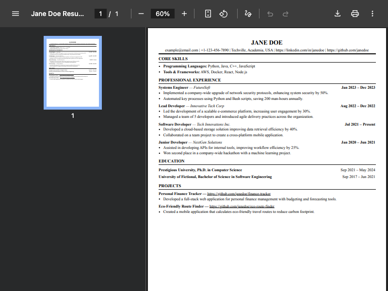
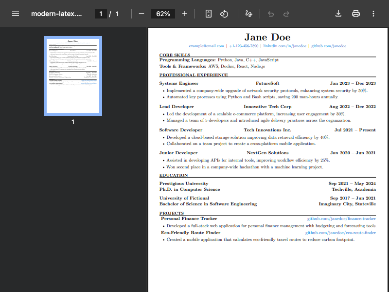
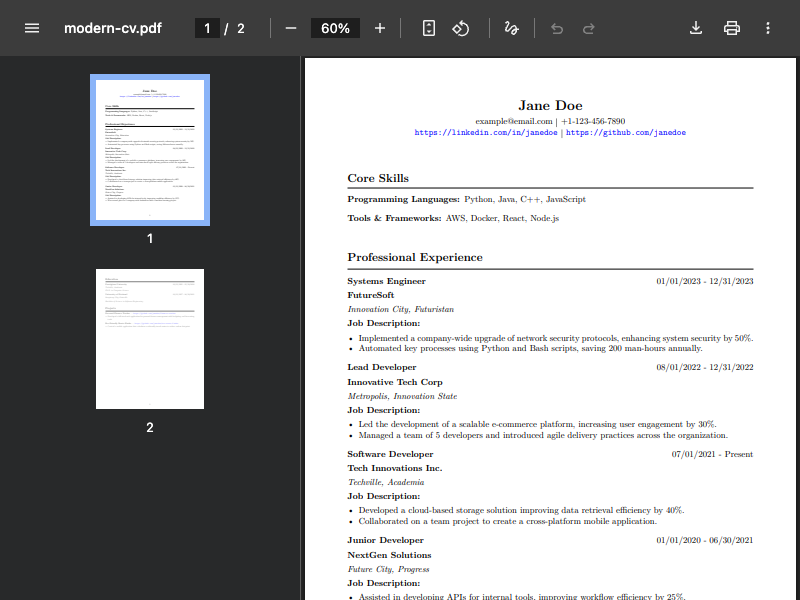

<p align="center">
  <h1 align="center">Incipit</h1>
  <p align="center">
    <em>Here begins the new career.</em>
    <br />
    A CLI tool that converts structured resume data (JSON/Markdown) into polished PDFs, HTML, LaTeX, DOCX, and Markdown — with AI-powered review, optimization, and creation.
    <br /><br />
    <a href="https://github.com/urmzd/incipit/releases">Download</a>
    &middot;
    <a href="https://github.com/urmzd/incipit/issues">Report Bug</a>
    &middot;
    <a href="https://github.com/urmzd/incipit/tree/main/assets">Examples</a>
  </p>
</p>

<p align="center">
  <a href="https://github.com/urmzd/incipit/actions/workflows/ci.yml"></a>
</p>

<br />

<p align="center">
  
</p>

## Output Examples

<p align="center">
  
  &nbsp;
  
  &nbsp;
  
</p>
<p align="center">
  <em>Modern HTML &nbsp;&middot;&nbsp; Modern LaTeX &nbsp;&middot;&nbsp; Modern CV</em>
</p>

## Features

- **Multiple Output Formats** — generate PDFs from LaTeX or HTML templates, plus native DOCX and Markdown
- **Data-Driven** — provide resume content as JSON or Markdown; the tool handles rendering
- **Template System** — modular templates with embedded assets; customize or create your own
- **AI-Powered Tools** — review, optimize, and create resumes using multi-provider LLMs (Anthropic, OpenAI, Google, Ollama)
- **Flexible Paths** — supports `~`, relative paths, and creates dated output workspaces
- **Schema Generation** — export JSON Schema for IDE autocompletion and validation

## Install

### Pre-built Binary

```bash
curl -fsSL https://raw.githubusercontent.com/urmzd/incipit/main/install.sh | bash
```

Supports **macOS** (Apple Silicon) and **Linux** (x86_64). After installation, run `incipit` from anywhere.

### Build from Source

```bash
git clone https://github.com/urmzd/incipit.git
cd incipit
go install ./cmd/incipit
```

## Quick Start

```bash
# Generate PDF with a specific template
incipit generate assets/example_resumes/software_engineer.json -t modern-html

# Generate with all templates
incipit generate assets/example_resumes/software_engineer.json

# Generate an editable DOCX
incipit generate resume.json -t modern-docx

# Validate input data
incipit generate resume.json --dry-run

# List available templates
incipit templates list

# AI: create resume from plain text
incipit ai create resume.txt -o resume.json

# AI: review a resume
incipit ai review resume.json

# AI: optimize for a job description
incipit ai optimize resume.json --job "Senior Go developer..."
```

## CLI Usage

### Generate

```bash
# Single template
incipit generate resume.json -t modern-html

# Multiple templates
incipit generate resume.json -t modern-html -t modern-latex

# Custom output directory
incipit generate resume.json -o outputs/custom -t modern-html
```

### AI Commands

AI commands support multiple providers, auto-detected from API keys (`ANTHROPIC_API_KEY`, `OPENAI_API_KEY`, `GOOGLE_API_KEY`) or falling back to local Ollama.

```bash
# Create structured JSON from plain text
incipit ai create resume.txt -o resume.json

# Review/score a resume (multi-agent analysis)
incipit ai review resume.json

# Optimize resume for a specific role
incipit ai optimize resume.json --job "Senior Go developer at a startup..."
incipit ai optimize resume.json --job job-description.txt -o optimized.json

# Specify provider explicitly
incipit ai review resume.json -p anthropic -m claude-sonnet-4-6-20250514
incipit ai review resume.json -p ollama -m qwen3.5:4b
```

### Other Commands

```bash
incipit generate resume.json --dry-run  # Validate and preview as JSON
incipit generate --schema               # Export JSON Schema
incipit templates list                   # List templates
incipit templates engines               # Check LaTeX engines
```

## Input Formats

Resumes are provided as **JSON** files. Use `incipit generate --schema` to get the full JSON Schema.

To convert freeform text to structured JSON, use `incipit ai create`.

## Prerequisites

- **Go 1.25+**
- **TeX Live** (only for LaTeX templates)
- **Chromium** — auto-downloaded by Rod on first use, or set `ROD_BROWSER_BIN`
- [just](https://github.com/casey/just) (optional, for helper commands)
- An LLM provider for AI commands: [Anthropic](https://anthropic.com), [OpenAI](https://openai.com), [Google](https://ai.google.dev), or [Ollama](https://ollama.com)

## Templates

Built-in templates live in `templates/`, one folder per template with a `metadata.yml` and template file:

| Template | Format | Output |
|----------|--------|--------|
| `modern-html` | HTML | PDF via Chromium |
| `modern-latex` | LaTeX | PDF via TeX Live |
| `modern-cv` | LaTeX | PDF via TeX Live |
| `modern-docx` | DOCX | Word document |
| `modern-markdown` | Markdown | `.md` file |

Create your own by adding a `templates/<name>/` directory with `metadata.yml` + template file.

## Agent Skill

This repo's conventions are available as portable agent skills in [`skills/`](skills/), following the [Agent Skills Specification](https://agentskills.io/specification).

Once installed, use `/resume` to create, review, optimize, and generate resumes from your agent.

## Contributing

Contributions welcome. See [CONTRIBUTING.md](CONTRIBUTING.md) for guidelines.

## License

Apache 2.0
